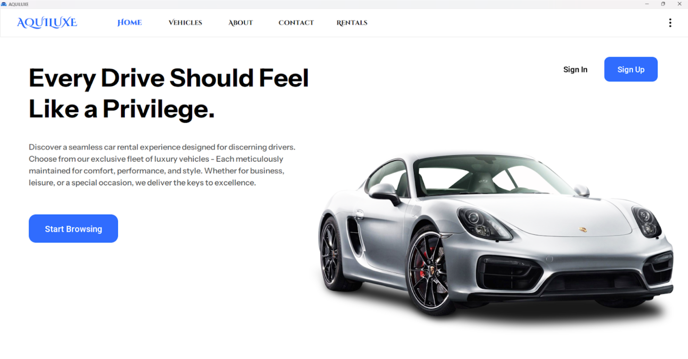
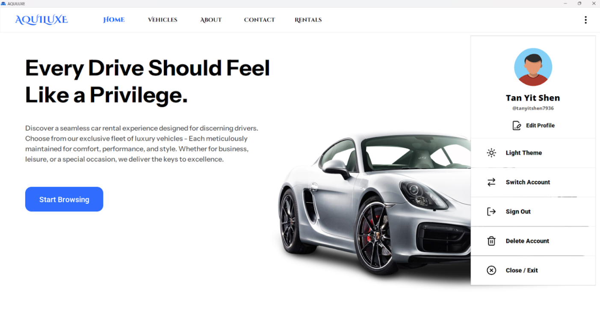
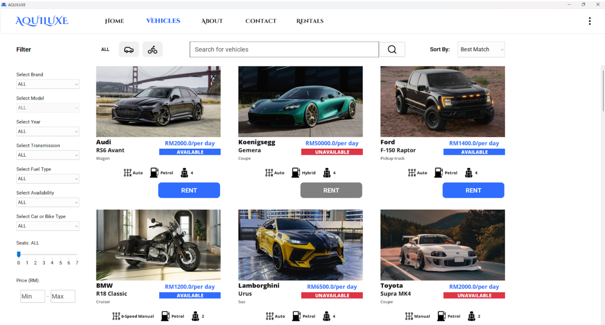
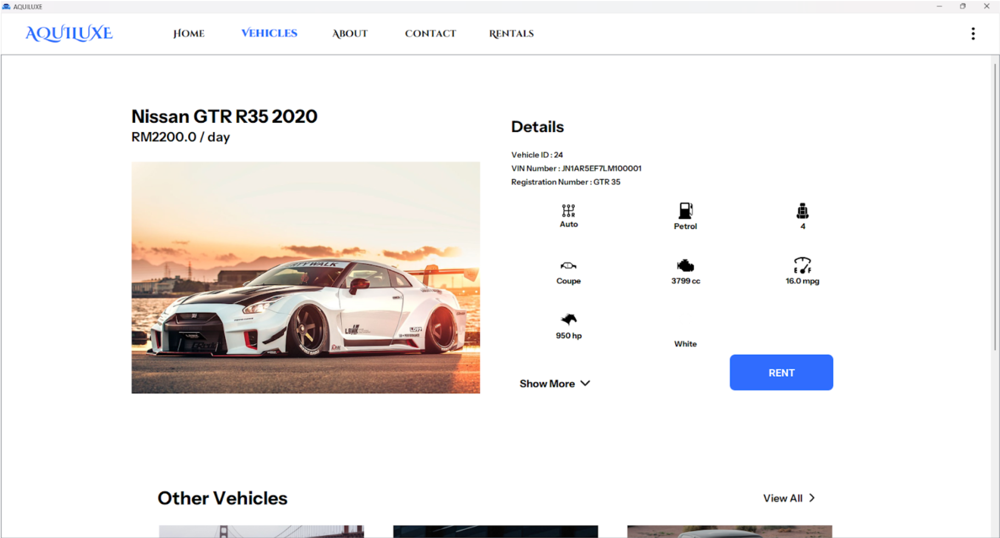
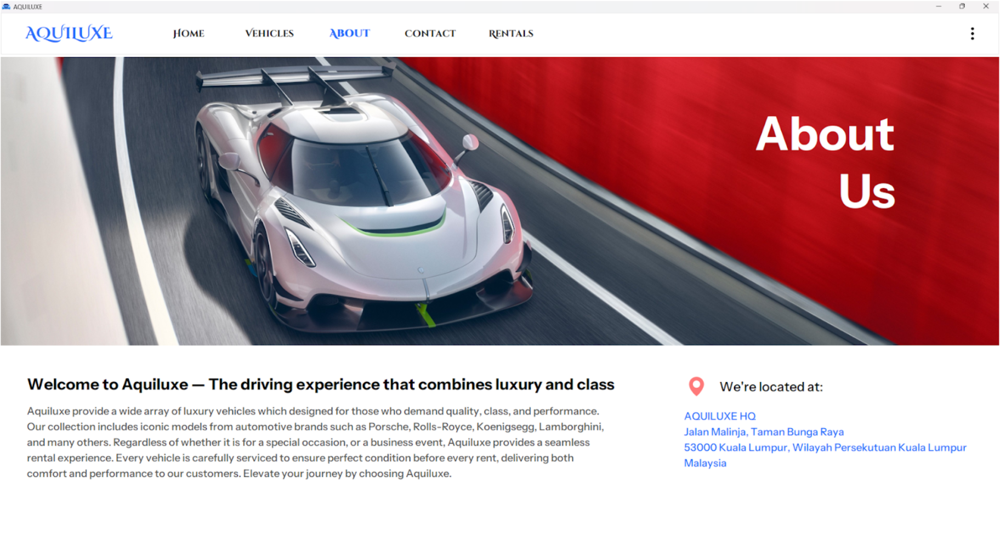

# Vehicle Rental Management System

## Table of Contents
- [Prerequisites / Before Running](#prerequisites--before-running)
- [Introduction](#introduction)
- [Tech Stack / Tools](#tech-stack--tools)
- [User Management](#user-management)
- [Vehicle Management](#vehicle-management)
- [Rental and Payment Management](#rental-and-payment-management)
- [Screenshots](#screenshots)

## Prerequisites / Before Running
- Make sure there is an **Internet connection** before running this application.
- Please set your **screen resolution to 1920 x 1080** for the best experience.  

To do this:
1. Go to **Settings → System → Display**  
2. Under **Scale & layout**, select **Display resolution**  
3. Choose **1920 x 1080** (with the **Scale of 100%**)

> **Note:** This project is currently a demonstration and is **no longer live**; the database service on AWS is not active. Screenshots and code illustrate the functionality and design of the system.

## Introduction
The Vehicle Rental Management System (VRMS) is a great software solution specifically designed to support Aquiluxe, a premium vehicle rental service that offers an extensive selection of luxury vehicles for clients who prioritize quality, elegance, and performance. 
This system efficiently streamlines essential rental operations, including vehicle availability tracking, reservation management, customer relations, maintenance scheduling, and returns processing. Our fleet features iconic models that cater to clients seeking exceptional vehicles for special events or business occasions. 
Aquiluxe is dedicated to providing a seamless rental experience, ensuring that each vehicle is meticulously serviced to guarantee it is in pristine condition before each rental, thus delivering both comfort and high performance to our customers. This service currently operates at a single branch location, with plans for expansion to other areas. For now, all pick-up and drop-off activities are done at this location.
By integrating all operational modules into a unified platform, the VRMS significantly enhances efficiency, minimizes administrative errors, and provides real-time insights into fleet utilization, customer behavior, and overall service effectiveness.

## Tech Stack / Tools
- **Programming Languages:** Java
- **GUI Toolkit:** Java Swing
- **Database:** PostgreSQL (used for development; AWS service no longer active)
- **Version Control:** Git/GitHub
- **Design / UI Tools:** Figma

## User Management
The User Management module is responsible for handling user authentication and authorization across different user roles, including guests, customers, and administrators.
Every single user has the ability to manage and update their personal profile, including editing their username, email address, phone number, and more. Signing out an account will end the user’s current session, ensuring secure logout from the system. If a user decides to delete their account, the system will perform a soft delete in the database while preserving the customers’ rental records as reference.
Every user must sign in and enter their own identity card number before renting a vehicle. Therefore a user with no identity card or is a guest will not be able to rent a vehicle unless the user is signed in and has entered their own identity card number.
Only customers can rent a vehicle, while administrators will not have the ability to rent a vehicle but to edit or add a new vehicle, and also manage customers' rentals. This means administrators have more privileges than normal users, as they have greater system controls.
Additionally, signed-in users are given the choice to customize their application theme, either light theme or dark theme to their own likings. A Switch Account feature is implemented allowing users to switch between accounts with just a single click, without having to sign in repeatedly to change to the desired account.

## Vehicle Management
The Vehicle Management module allows users to search, sort and filter vehicles to find vehicles easily through the vehicle page. It also helps administrators to manage the vehicle inventory, including adding new vehicles, editing existing information, or removing vehicles from the system.
The Vehicle Page includes a search bar to quickly find specific vehicles using a simple searching algorithm. It also offers intuitive filter UI elements such as combo boxes and sliders so that users can find vehicles based on attributes, such as brand, model, year and rental price. Additionally,users can choose to sort vehicles by year or price and also filter results by vehicle category, such as cars and bikes.
Only administrators with the manager role can have access to advanced management functions. They can delete a vehicle from the system by pressing the “Delete” button or update vehicle details by pressing the “Edit” button and add new vehicles into the system by pressing the add icon button through the vehicle page.
Both the Add and Edit Vehicle feature works similarly as they use a submission form that requires administrators to provide all relevant vehicle data. The submission form includes input validation checks to validate inputs such as vehicle image, VIN number and registration number through exception handling and popup dialogs to prevent errors and ensure data accuracy. Deleting a vehicle, will perform a soft delete in the database while preserving the customers’ rental records as reference.

## Rental and Payment Management
The Rental Management module handles the essential features of allowing customers to rent available vehicles in the system. A Rental Summary is displayed to customers to provide a summary of the rental being placed. Customers can book a vehicle rental through the vehicle or vehicle details page by pressing the “Rent” button. The billing details are bound to the customer’s account for an easy and less problematic record tracking in case of any issues. Rental details will also be saved along with any other information to track the rental status, date, and time. 
The Payment Management is also included inside the vehicle rental page, by saving the essential information needed, such as payment method, payment date, and payment token, which is generated from our payment gateway partners, leaving the sensitive data to them ensures a safe and trusted payment process for customers.
The system includes a My Rentals history page, allowing customers to monitor their past rentals and cancel any pending or approved rentals if there are any mistakes. However, administrators using the rentals page will be directed to a rental management page, where they can approve or reject pending rentals, update the rental status to active once the customer has picked up their vehicle, and finalize the rental period by indicating that the customer has returned the vehicle. 

## Screenshots
Some screenshots taken from the system is shown below.

